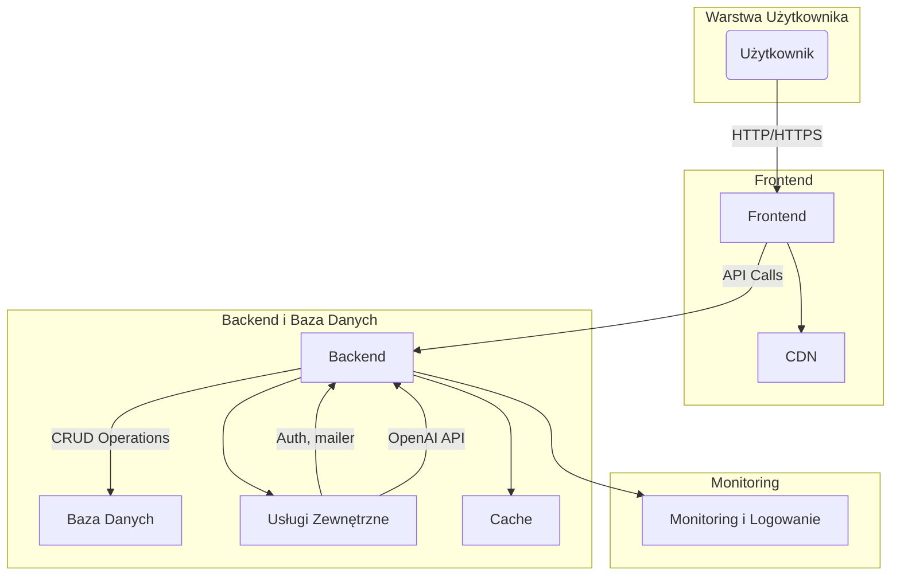
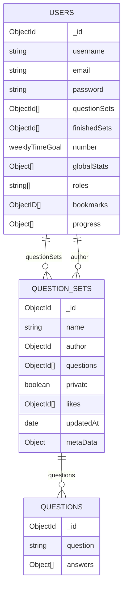

# Dokumentacja Techniczna interaktywnej aplikacji edukacyjnej wspomaganej przez ChatGPT

**Nazwa Aplikacji**:  Testo
**Wersja**:  1.0.0
**Autor**:  Stefan Grzelec
**Repozytorium**:  https://github.com/Spoky03/testownik-react

---

## 1. Wprowadzenie

### 1.1 Opis projektu
Aplikacja fullstack do rozwiązywania quizów z możliwościami udostępniania i tworzenia quizów. Z implementacją openai

### 1.2 Cele aplikacji
- Pomoc w nauce
- Motywacja do nauki
- Nauka poprzez proste quizy

---

## 2. Architektura Systemu

### 2.1 Ogólny Przegląd


### 2.2 Technologie
- **Frontend**: React, Redux Toolkit, RadixUI, TailwindCSS.
- **Backend**: Node.js, Nest.js.
- **Baza Danych**: MongoDB (mongoose)
- **Inne**: 

### 2.3 Wzorce Projektowe
Decorators, MVC

---

## 3. Frontend

### 3.1 Struktura Plików
- **components**: komponenety react
- **assets**: obrazy itp
- **locales**: wersje językowe
- **reducers**: definicje aktualizacji stanu aplikacji
- **services**: serwis komunikacji z backendem
- **types**: typy
- **lib**: funkcje pomocnicze


### 3.2 Technologie i Biblioteki
- Typescript
- Vite
- PostCSS
- React
- Redux Toolkit
- Tailwind
- zod
- RadixUI
- ShadcnUI
- recharts
- Framer Motion
- Axios

### 3.3 Kluczowe Komponenty
- Strona główna
- Quiz
- Zestawy użytkownika
- Postępy
- Edytowanie zestawów

### 3.4 Logika Stanu
Redux toolkit przechowuje i aktualizuje stan aplikacji otrzymując dane i wykonując zapytania do servera.

### 3.5 Komunikacja z Backendem
RestAPI

---

## 4. Backend

### 4.1 Struktura Plików
src:
- **auth**: serwis związany z uwierzytelnianiem oraz autoryzacją
- **database**: moduł bazodanowy
- **helpers**: funkcje pomocnicze
- **interfaces**: typy
- **mail**: moduł mailowy
- **questions**: moduł pytań
- **questionsSets**: moduł quizów
- **schemas**: definicje bazy danych
- **tasks**: crony
- **users**: moduł użytkowników

### 4.2 Technologie i Biblioteki
- Typescript
- Node.js
- Mongoose
- Nest.js
- nodemailer

### 4.3 Endpoints API

```api/users``` :
| Metoda | Endpoint                | Opis                                               | Parametry                |
|--------|-------------------------|----------------------------------------------------|--------------------------|
| GET | `/me` | Zwracam informacje o użytkowniku | `--` | 
| PUT    | `/me`               | Aktualizuje informacje o użytkowniku               | `userData`               |
| DELETE | `/me`               | Usuwa konto użytkownika                            |                          |
| POST   | `/`                  | Tworzy nowego użytkownika                          | `createUserDto`          |
| PUT    | `/settings`         | Zapisuje ustawienia użytkownika                    | `settings`               |
| PUT    | `/progress`         | Zapisuje postęp użytkownika                        | `Progress`               |
| GET    | `/progress`         | Zwraca postęp użytkownika                          |                          |
| DELETE | `/progress/:id`     | Resetuje postęp użytkownika                        | `id`                     |
| POST   | `/bookmarks`        | Dodaje zakładkę                                    | `id`                     |
| DELETE | `/bookmarks/:id`    | Usuwa zakładkę                                     | `id`                     |
| GET    | `/foreign`          | Zwraca zestawy pytań oznaczone jako obce           |                          |
| GET    | `/globalStats`      | Zwraca globalne statystyki użytkownika             | `startDate`, `endDate`   |
| GET    | `/weeklyTimeGoal`   | Zwraca tygodniowy cel czasowy użytkownika          |                          |
| POST   | `/weeklyTimeGoal`   | Zapisuje tygodniowy cel czasowy użytkownika        | `weeklyTimeGoal`         |
| GET    | `/finishedSets`     | Zwraca ukończone zestawy użytkownika               |                          |
| POST   | `/finishedSets`     | Zapisuje ukończony zestaw użytkownika              | `finishedSet`            |

```api/sets``` :
| Metoda | Endpoint                   | Opis                                               | Parametry                |
|--------|----------------------------|----------------------------------------------------|--------------------------|
| GET    |       `/`          | Zwraca wszystkie zestawy pytań                     |                          |
| POST   |     `/`            | Tworzy nowy zestaw pytań                           | `createQuestionSetDto`   |
| PUT    | `/:id`            | Edytuje istniejący zestaw pytań                    | `editQuestionSetDto`, `id` |
| GET    | `/:id`            | Zwraca jeden zestaw pytań                          | `id`                     |
| DELETE | `/:id`            | Usuwa jeden zestaw pytań                           | `id`                     |
| PUT    | `/:id/privacy`    | Zmienia prywatność zestawu pytań                   | `id`                     |
| POST   | `/:id/like`       | Dodaje lub usuwa polubienie zestawu pytań          | `id`                     |

```api/questions``` :

| Metoda | Endpoint                          | Opis                                  | Parametry                |
|--------|-----------------------------------|----------------------------------------------------|--------------------------|
| GET    |     `/`              | Zwraca wszystkie pytania                           |                          |
| POST   |     `/`              | Dodaje pytania do zestawu                          | `appendQuestionsDto`     |
| DELETE | `/:id`              | Usuwa pytanie                                      | `id`                     |
| PUT    | `/:id`              | Aktualizuje pytanie                                | `id`, `body`             |
| PUT    | `/:id/image`        | Przesyła obraz do pytania                          | `file`                   |
| POST   | `/:id/voteDifficulty`| Głosuje na trudność pytania                        | `id`, `DifficultyVoteDto`|

```auth``` :

| Metoda | Endpoint         | Opis                                               | Parametry                |
|--------|------------------|----------------------------------------------------|--------------------------|
| POST   | `/login`    | Loguje użytkownika                                 | `signInDto`              |
| POST   | `/auth/register` | Rejestruje nowego użytkownika                      | `signUpDto`              |
| GET    | `/auth/profile`  | Zwraca profil zalogowanego użytkownika             |                          |


```api/openai``` :

| Metoda | Endpoint             | Opis                                               | Parametry                          |
|--------|----------------------|----------------------------------------------------|------------------------------------|
| POST   | `/ask`    | Tworzy wyjaśnienie pytania                         | `CreateAskForExplanationRequest`   |
| POST   | `/chat`   | Tworzy chat completion na podstawie wiadomości     | `CreateChatCompletionRequest`      |

### 4.4 Autoryzacja i Autentykacja
Json web token, wbudowane narzędia nest.js

### 4.5 Walidacja Danych
DTO, class-validators

---

## 5. Baza Danych

## 5.1 Schemat Bazy Danych

Baza danych wykorzystuje **MongoDB** do przechowywania danych o użytkownikach, zestawach pytań oraz pytaniach. Struktura bazy danych obejmuje trzy główne kolekcje: `users`, `question_sets`, `questions`. Każda z tych kolekcji jest powiązana poprzez referencje do dokumentów, co pozwala na łatwe zarządzanie relacjami między danymi.

### Diagram ERD (Entity-Relationship Diagram)



## 6. Wdrożenie

### 6.1 Wymagania Systemowe
- **Środowisko Uruchomieniowe**: wymagany node.js oraz git

### 6.2 Konfiguracja
#### Zmienne środowiskowe:
- CONSUMER_KEY="abc"
- CONSUMER_SECRET="abc"
- DATABASE_URL="mongodb+srv://abc"
- DB_PASSWORD="abc"
- JWT_SECRET="abc"
- OPENAI_API_KEY="sk-proj-abc"
- SECRET="abc"
- PORT=3001
- SMTP_HOST=smtp.gmail.com
- SMTP_PORT=465
- SMTP_USER=your-email@gmail.com
- SMTP_PASS=your-email-password

### 6.3 Instrukcje Instalacji w środowisku lokalnym
```sh
    cd client
    npm run build:prod (build:prod-w on windows)
    cd ..
    cd server
    npm run build
```

### 6.4 Proces Wdrożenia na heroku
```sh
    cd server
    npm run deploy -m "your commit message"
```
następnie: merge pull main <-- develop

## 7. Bezpieczeństwo

### 7.1 Środki Bezpieczeństwa
- React sanityzuje wszystkie inputy
- DTO
- RoleGuards

### 7.2 Zarządzanie Danymi Osobowymi
~~Zasady przetwarzania i przechowywania danych osobowych zgodnie z wymogami RODO.~~
---

## 8. Monitoring i Logowanie

Wbudowane narzędzie monitorowania heroku


**Dokument przygotowany przez**: Stefan Grzelec  
**Data aktualizacji**: 06-11-2024
