# Dokumentacja Techniczna Aplikacji Fullstack

**Nazwa Aplikacji**:  Testo
**Wersja**:  1.0.0
**Autor**:  Stefan Grzelec
**Repozytorium**:  https://github.com/Spoky03/testownik-react

---

## 1. Wprowadzenie

### 1.1 Opis projektu
Aplikacja fullstack do rozwiązywania quizów z możliwościami udostępniania i tworzenia quizów. Z implementacją openai

### 1.2 Cele aplikacji
- Pomoc w nauce
- Motywacja do nauki
- Nauka poprzez proste quizy

---

## 2. Architektura Systemu

### 2.1 Ogólny Przegląd

```mermaid
graph TD
    %% Frontend Section
    A[Frontend] -->|API Calls| B[Backend]
    
    %% Backend Section
    B[Backend] -->|CRUD Operations| C[Baza Danych]
    B --> D[Usługi Zewnętrzne]

    %% External Services Section
    D -->|Auth, mailer| B
    D -->|AWS S3| B
    
    %% Monitoring and Logging
    B --> E[Monitoring i Logowanie]

    %% User Access
    Z(Użytkownik) -->|HTTP/HTTPS| A
    
    %% Cache Layer (Optional)
    B --> F[Cache]

    %% CDN
    A --> G[CDN]

    %% Labels
    subgraph "Warstwa Użytkownika"
      Z
    end
    
    subgraph "Frontend"
      A
      G
    end
    
    subgraph "Backend i Baza Danych"
      B
      C
      F
      D
    end
    
    subgraph "Monitoring"
      E
    end
```


### 2.2 Technologie
- **Frontend**: React, Redux Toolkit, RadixUI, TailwindCSS.
- **Backend**: Node.js, Nest.js.
- **Baza Danych**: MongoDB (mongoose)
- **Inne**: 

### 2.3 Wzorce Projektowe
Decorators, MVC

---

## 3. Frontend

### 3.1 Struktura Plików
- **components**: komponenety react
- **assets**: obrazy itp
- **locales**: wersje językowe
- **reducers**: definicje aktualizacji stanu aplikacji
- **services**: serwis komunikacji z backendem
- **types**: typy
- **lib**: funkcje pomocnicze


### 3.2 Technologie i Biblioteki
- Typescript
- Vite
- PostCSS
- React
- Redux Toolkit
- Tailwind
- zod
- RadixUI
- ShadcnUI
- recharts
- Framer Motion
- Axios

### 3.3 Kluczowe Komponenty
Opis głównych komponentów interfejsu użytkownika i ich funkcji.

### 3.4 Logika Stanu
Redux toolkit przechowuje i aktualizuje stan aplikacji otrzymując dane i wykonując zapytania do servera.

### 3.5 Komunikacja z Backendem
RestAPI

---

## 4. Backend

### 4.1 Struktura Plików
Opis struktury katalogów i plików w folderze backendowym.

### 4.2 Technologie i Biblioteki
- Typescript
- Node.js
- Mongoose
- Nest.js
- nodemailer

### 4.3 Endpoints API

| Metoda | Endpoint            | Opis                                  | Parametry          |
|--------|----------------------|---------------------------------------|---------------------|
| GET    | `/api/users`        | Pobiera listę użytkowników            | `page`, `limit`    |
| POST   | `/api/users`        | Tworzy nowego użytkownika             | `name`, `email`    |

### 4.4 Logika Biznesowa
Opis kluczowych funkcji i algorytmów zaimplementowanych po stronie backendu.

### 4.5 Autoryzacja i Autentykacja
Json web token

### 4.6 Walidacja Danych
DTO, class-validators

---

## 5. Baza Danych

## 5.1 Schemat Bazy Danych

Baza danych wykorzystuje **MongoDB** do przechowywania danych o użytkownikach, zestawach pytań oraz pytaniach. Struktura bazy danych obejmuje trzy główne kolekcje: `users`, `question_sets`, `questions`. Każda z tych kolekcji jest powiązana poprzez referencje do dokumentów, co pozwala na łatwe zarządzanie relacjami między danymi.

### Diagram ERD (Entity-Relationship Diagram)


---

## 6. Testy

### 6.1 Testy Jednostkowe
Opis struktury i pokrycia testów jednostkowych (np. testy komponentów frontendowych, testy funkcji backendowych).

### 6.2 Testy Integracyjne
Opis testów integracyjnych (np. testy API, testy bazy danych).

### 6.3 Narzędzia do Testów
Lista narzędzi do testowania (np. Jest, Mocha, Cypress).

---

## 7. Wdrożenie

### 7.1 Wymagania Systemowe
- **Serwer**: Minimalne wymagania sprzętowe i system operacyjny.
- **Środowisko Uruchomieniowe**: Wersje języka programowania, bazy danych, itp.

### 7.2 Konfiguracja
#### Zmienne środowiskowe:
- CONSUMER_KEY="abc"
- CONSUMER_SECRET="abc"
- DATABASE_URL="mongodb+srv://..."
- DB_PASSWORD=""
- JWT_SECRET="abc"
- OPENAI_API_KEY="sk-proj-abc"
- SECRET="abc"
- PORT=3001
- SMTP_HOST=smtp.gmail.com
- SMTP_PORT=465
- SMTP_USER=your-email@gmail.com
- SMTP_PASS=your-email-password

### 7.3 Instrukcje Instalacji w środowisku lokalnym
```sh
    cd client
    npm run build:prod (build:prod-w on windows)
    cd ..
    cd server
    npm run build
```

### 7.4 Proces Wdrożenia na heroku
```sh
    cd server
    npm run deploy -m "your commit message"
```
then merge develop to main

## 8. Bezpieczeństwo

### 8.1 Środki Bezpieczeństwa
Opis środków bezpieczeństwa wdrożonych w aplikacji (np. zabezpieczenia przed CSRF, XSS, SQL Injection).

### 8.2 Zarządzanie Danymi Osobowymi
Zasady przetwarzania i przechowywania danych osobowych zgodnie z wymogami RODO.

---

## 9. Monitoring i Logowanie

### 9.1 Logowanie
Opis struktury logów oraz narzędzi do logowania.

### 9.2 Monitoring
Opis narzędzi do monitoringu aplikacji (np. Prometheus, Grafana).

### 9.3 Zarządzanie Błędami
Opis strategii obsługi błędów i ich zgłaszania (np. Sentry, własne mechanizmy alertów).


**Dokument przygotowany przez**: Stefan Grzelec  
**Data aktualizacji**: 06-11-2024
